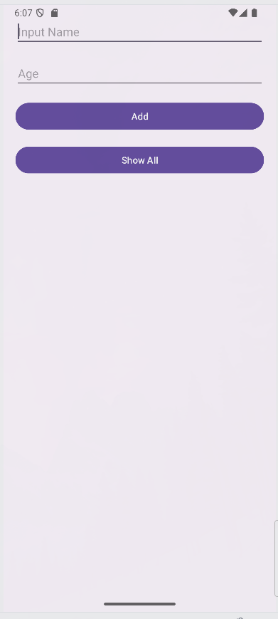
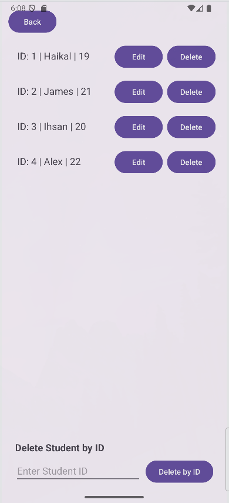

# Week 6 Lab - Local Database with Room

A simple Android application demonstrating local database implementation using the Room persistence library. This app provides a complete CRUD (Create, Read, Update, Delete) interface for managing student records.

## Features

- **Add Students**: Create new student records with name and age
- **View Students**: Display all students in a scrollable list
- **Edit Students**: Update existing student information
- **Delete Students**: Remove students by selection or ID
- **Data Validation**: Input validation with error handling
- **Confirmation Dialogs**: User-friendly delete confirmations

## Screenshots

| | |
|:---:|:---:|
|  |  |
| **Main Activity - Add Students** | **Next Activity - Manage Students** |

## Technical Stack

- **Language**: Kotlin
- **Database**: Room Persistence Library (v2.7.2)
- **Architecture**: MVVM pattern
- **Asynchronous Operations**: Kotlin Coroutines
- **UI Components**:
  - RecyclerView for list display
  - Material Design components
  - ConstraintLayout for responsive design

## Project Structure

```
app/src/main/java/com/example/local_database_room/
├── MainActivity.kt          # Activity for adding new students
├── NextActivity.kt         # Activity for viewing/editing students
├── AppDatabase.kt          # Room database configuration
├── Student.kt             # Entity data class
├── StudentDAO.kt          # Data Access Object interface
└── StudentAdapter.kt      # RecyclerView adapter
```

## Database Schema

**Student Entity**
- `id`: Long (Primary Key, auto-generated)
- `name`: String
- `age`: Int

## Setup Instructions

### Prerequisites
- Android Studio Hedgehog or newer
- Minimum SDK: 24
- Target SDK: 36

### Building the Project
1. Clone or download the project
2. Open in Android Studio
3. Sync Gradle dependencies
4. Run the app on an emulator or physical device

### Dependencies
```kotlin
// Room Database
implementation("androidx.room:room-runtime:2.7.2")
implementation("androidx.room:room-ktx:2.7.2")
ksp("androidx.room:room-compiler:2.7.2")

// Kotlin Coroutines
implementation("androidx.lifecycle:lifecycle-runtime-ktx:2.8.7")
```

## Usage

### Adding Students
1. Enter student name in the "Input Name" field
2. Enter student age in the "Age" field
3. Click "ADD" button
4. Toast message confirms successful addition

### Managing Students
1. Click "Next Activity" to view all students
2. Use the "Edit" button to modify student information
3. Use the "Delete" button to remove a student with confirmation
4. Use the "Delete by ID" section to delete students by their ID

### Key Features
- All database operations run on background threads using coroutines
- Input validation ensures valid age entries
- Edit form appears inline for quick updates
- Confirmation dialogs prevent accidental deletions

## Database Operations

### Create
```kotlin
lifecycleScope.launch {
    studentDao.insert(student)
}
```

### Read
```kotlin
lifecycleScope.launch {
    val students = dao.getAllStudents()
    adapter.updateStudents(students)
}
```

### Update
```kotlin
lifecycleScope.launch {
    dao.update(updatedStudent)
}
```

### Delete
```kotlin
lifecycleScope.launch {
    dao.delete(student)
}
```

## Notes

- Database version is 1 with exportSchema disabled
- Database file name: "student_database"
- Singleton pattern ensures single database instance
- All DAO functions are suspend functions for async operations

## License

This project is for educational purposes only.